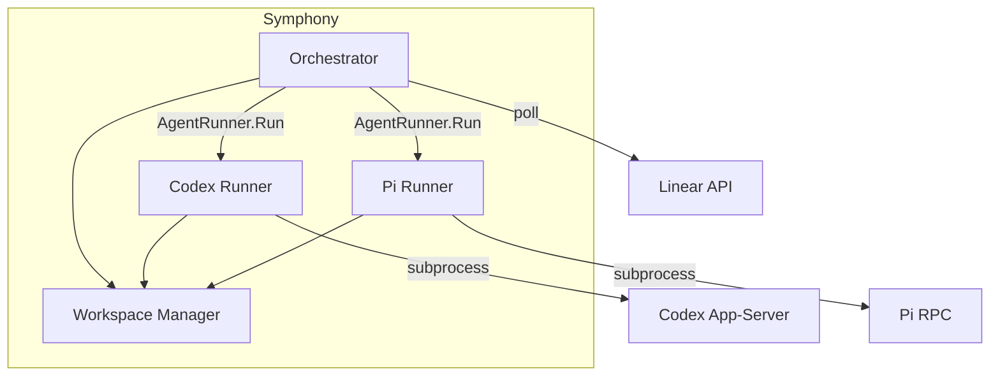
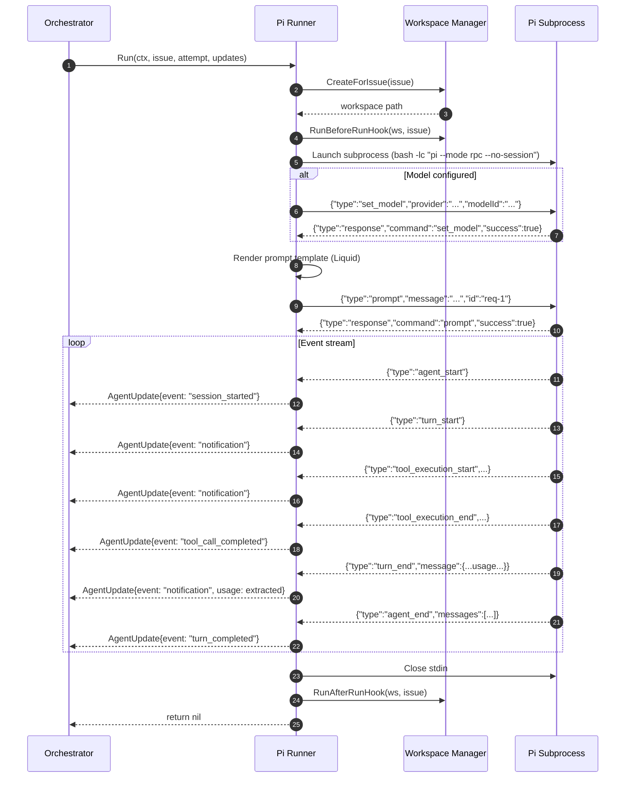
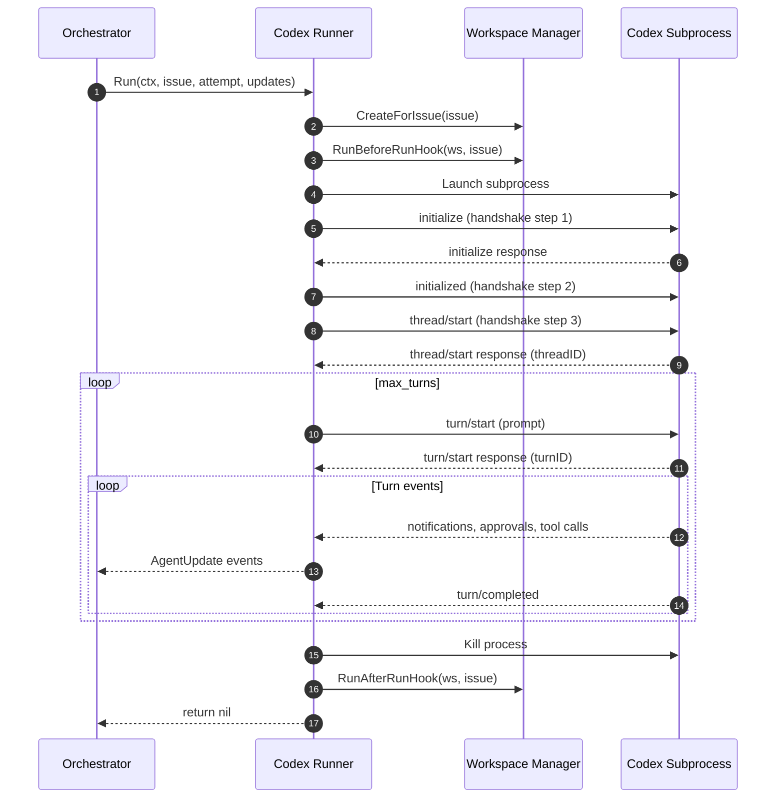
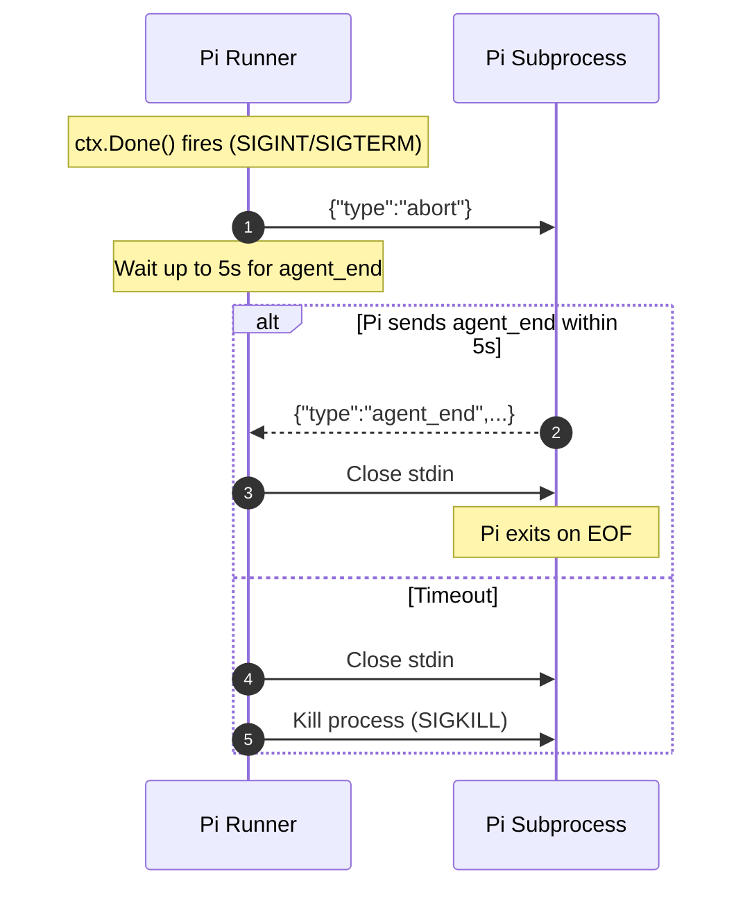

# Pi RPC Agent Runner — Technical Design

**Ticket:** CFW-51  
**Date:** 2026-05-24  
**Status:** Draft

---

## Overview

Symphony gains a second agent runner that speaks the Pi RPC protocol. The operator chooses between runners in WORKFLOW.md via a `runner` field. The rest of the system (orchestrator, dashboard, stall detection, retry) behaves identically regardless of which runner is active.

The Pi runner launches a `pi --mode rpc --no-session` subprocess per issue, sends a single prompt, streams events until the agent finishes, and shuts down. Pi handles tool execution, approval, compaction, and retry internally. The runner's job is to translate Pi events into the existing `AgentUpdate` stream so the orchestrator can track progress.

---

## System Context



Only one runner is active per Symphony instance. The orchestrator calls whichever `AgentRunner` was wired at startup.

---

## Agent Run Flow — Pi Runner



---

## Agent Run Flow — Codex Runner (existing, for comparison)



---

## Key Behavioral Differences

| Concern | Codex Runner | Pi Runner |
|---------|-------------|-----------|
| **Startup** | 3-step handshake (initialize, initialized, thread/start) | No handshake. Subprocess is ready immediately. |
| **Prompt delivery** | `turn/start` with input array and sandbox policy | `prompt` command with plain message string |
| **Multi-turn** | Runner sends explicit `turn/start` per turn, up to `max_turns` | Runner sends one `prompt`. Pi handles tool loops internally. Orchestrator continuation re-dispatches `Run()`. |
| **Approval** | Runner auto-responds to approval requests based on `approval_policy` | Pi handles approval internally. Runner never sees approval events. |
| **Tool dispatch** | Runner dispatches registered tools (e.g. `linear_graphql`) on `item/tool/call` | Pi handles tools via its own extensions/skills. No tool dispatch in runner. |
| **Completion signal** | `turn/completed` method event | `agent_end` event |
| **Token usage** | Extracted from `usage` field on turn events | Extracted from `message.usage` inside `turn_end` events |
| **Shutdown** | Kill subprocess process | Send `abort` command, then close stdin. Pi exits on EOF. |
| **Compaction** | Does not happen | Pi may compact mid-run. Produces `compaction_start`/`compaction_end` events. |
| **Internal retry** | Does not happen | Pi may auto-retry on transient errors. Produces `auto_retry_start`/`auto_retry_end` events. |

---

## Event Mapping

The Pi client translates Pi RPC events into `AgentUpdate` values. Every mapped event carries a timestamp, which the orchestrator uses for stall detection.

| Pi RPC Event | AgentUpdate.Event | Token Usage Extracted? | Notes |
|-------------|-------------------|----------------------|-------|
| `agent_start` | `session_started` | No | Marks the beginning of agent processing |
| `agent_end` | `turn_completed` | No | Terminal event. Runner returns after this. |
| `turn_start` | `notification` | No | Internal Pi turn boundary |
| `turn_end` | `notification` | **Yes** — from `message.usage` | Each turn carries input/output/cache token counts |
| `message_start` | (ignored) | No | Granularity not needed for orchestrator |
| `message_update` | (ignored) | No | Streaming deltas. Too noisy for orchestrator. |
| `message_end` | (ignored) | No | |
| `tool_execution_start` | `notification` | No | Heartbeat for stall detection |
| `tool_execution_update` | (ignored) | No | Streaming tool output. Too noisy. |
| `tool_execution_end` | `tool_call_completed` | No | |
| `compaction_start` | `compaction_started` | No | **Heartbeat.** Prevents stall false-positive during compaction (can take 30-60s). |
| `compaction_end` | `compaction_ended` | No | Heartbeat. |
| `auto_retry_start` | `auto_retry_started` | No | **Heartbeat.** Prevents stall false-positive during retry delay. |
| `auto_retry_end` | `auto_retry_ended` | No | Heartbeat. |
| `queue_update` | (ignored) | No | Not relevant to orchestrator |
| `extension_error` | `notification` | No | Logged as warning |
| `extension_ui_request` | (see below) | No | Requires special handling |
| `response` | (internal) | No | Command responses are consumed by the client, not forwarded |

### Extension UI Requests

Pi extensions can emit `extension_ui_request` events that expect a response on stdin. In headless Symphony mode, the Pi client auto-cancels all dialog requests:

- `select`, `input`, `editor`: respond with `{"type":"extension_ui_response","id":"...","cancelled":true}`
- `confirm`: respond with `{"type":"extension_ui_response","id":"...","confirmed":false}`
- `notify`, `setStatus`, `setWidget`, `setTitle`, `set_editor_text`: fire-and-forget, no response needed

This prevents extension dialogs from blocking the run indefinitely. The Pi client logs a warning when it auto-cancels a dialog.

---

## Token Usage Extraction

Codex embeds usage at the top level of turn events:

    {"method":"turn/completed","usage":{"input_tokens":100,"output_tokens":50,"total_tokens":150}}

Pi embeds usage inside the assistant message in `turn_end`:

    {
      "type": "turn_end",
      "message": {
        "role": "assistant",
        "usage": {
          "input": 100,
          "output": 50,
          "cacheRead": 40,
          "cacheWrite": 5,
          "cost": {"input": 0.0003, "output": 0.00075, "total": 0.00105}
        }
      }
    }

The Pi client maps this to the existing `TokenUsage` struct:

| Pi field | TokenUsage field |
|----------|-----------------|
| `usage.input` | `InputTokens` |
| `usage.output` | `OutputTokens` |
| `usage.input + usage.output` | `TotalTokens` |

The `cacheRead`, `cacheWrite`, and `cost` fields are not mapped in v1. They can be added later if the dashboard needs cost tracking.

---

## Stall Detection Interaction

The orchestrator's stall detector checks `LastCodexTimestamp` against `StallTimeoutMS`. If no `AgentUpdate` arrives within the timeout window, the orchestrator kills the run and schedules a retry.

**Problem:** Pi can go silent for extended periods during:
1. **Compaction** — 30-60 seconds while Pi summarizes context
2. **Auto-retry delays** — up to 30 seconds between retry attempts
3. **Long tool execution** — large file reads, complex bash commands

**Solution:** The Pi client emits heartbeat `AgentUpdate` events for `compaction_start`, `compaction_end`, `auto_retry_start`, `auto_retry_end`, and `tool_execution_start`. Each carries a timestamp that resets the stall timer. No changes needed in the orchestrator.

**Remaining risk:** If Pi hangs completely (no events at all), the stall detector still fires correctly. The heartbeat approach only suppresses false positives during known-silent phases.

---

## Retry Interaction

Two retry systems exist:

1. **Pi internal retry** — Pi retries transient LLM errors (429, 529, 5xx) up to 3 times with exponential backoff. The Pi client sees `auto_retry_start`/`auto_retry_end` events.

2. **Orchestrator retry** — When `Run()` returns an error, the orchestrator schedules a retry with exponential backoff (10s base, up to `max_retry_backoff_ms`).

These are complementary, not redundant:
- Pi retry handles transient LLM errors within a single prompt execution. If all Pi retries fail, the prompt fails.
- Orchestrator retry handles run-level failures (process crash, prompt rejection, Pi itself failing). It re-creates the workspace and starts fresh.

**Worst case:** Pi retries 3x internally, all fail. `Run()` returns error. Orchestrator retries with backoff. Each orchestrator attempt triggers a fresh Pi run with its own 3 internal retries. This is acceptable — the orchestrator backoff grows exponentially (10s, 20s, 40s, ..., up to max), so the compounding is bounded.

---

## Graceful Shutdown



The Codex runner simply kills the process. The Pi runner tries a clean abort first because Pi may be in the middle of writing files or running git commands.

---

## Configuration

### New config fields

| Field | Type | Default | Description |
|-------|------|---------|-------------|
| `runner` | string | `"codex"` | Which runner to use. Values: `"codex"`, `"pi"`. |
| `pi.command` | string | `"pi --mode rpc --no-session"` | Command to launch Pi subprocess. |
| `pi.model` | string | (empty) | Model to set via `set_model` after launch. Format: `"provider/modelId"` or `"provider/modelId:thinkingLevel"`. If empty, Pi uses its default model. |
| `pi.read_timeout_ms` | int | `30000` | Timeout for reading the prompt response from Pi. Higher than Codex default (5000) because Pi may load extensions on first command. |
| `pi.turn_timeout_ms` | int | `600000` | Maximum time for a single prompt execution (agent_start to agent_end). |

### Validation rules

| Runner | Required | Not required |
|--------|----------|-------------|
| `codex` (default) | `codex.command` | `pi.*` fields |
| `pi` | `pi.command` | `codex.command` |

Both runners always require: `tracker.kind`, `tracker.api_key`, `tracker.project_slug`.

### WORKFLOW.md example

```yaml
runner: pi
tracker:
  kind: linear
  api_key: $LINEAR_API_KEY
  project_slug: my-project
pi:
  command: "pi --mode rpc --no-session"
  model: "anthropic/claude-sonnet-4-20250514:high"
  read_timeout_ms: 30000
  turn_timeout_ms: 600000
workspace:
  root: ~/symphony_workspaces
agent:
  max_concurrent_agents: 5
  max_turns: 10
```

### Model string parsing

The `pi.model` field uses the format `provider/modelId` with an optional `:thinkingLevel` suffix.

| Input | `set_model` provider | `set_model` modelId | `set_thinking_level` level |
|-------|---------------------|--------------------|-----------------------------|
| `anthropic/claude-sonnet-4-20250514` | `anthropic` | `claude-sonnet-4-20250514` | (not sent) |
| `anthropic/claude-sonnet-4-20250514:high` | `anthropic` | `claude-sonnet-4-20250514` | `high` |
| `openai/o3` | `openai` | `o3` | (not sent) |
| (empty) | (not sent) | (not sent) | (not sent) |

---

## Session ID Generation

Codex provides explicit `threadID` and `turnID` from handshake responses. Pi does not return a session ID in the prompt response.

The Pi client generates a session ID by combining the issue identifier with a timestamp:

    sessionID = fmt.Sprintf("pi-%s-%d", issue.Identifier, time.Now().UnixMilli())

This is used for:
- `AgentUpdate.SessionID` (orchestrator tracking)
- `runningEntry.SessionID` (dashboard display)
- Log correlation

The Pi client can also call `get_state` after launch to retrieve Pi's internal `sessionId`, but this adds a round-trip. The generated ID is sufficient for orchestrator tracking. If Pi's internal session ID is needed later (e.g., for session resume), `get_state` can be added.

---

## Dynamic Tools — linear_graphql

The Codex runner registers `linear_graphql` as a dynamic tool and dispatches it on `item/tool/call`. Pi does not support external tool registration via its RPC protocol.

**Options considered:**

1. **Skip it.** Pi has its own tools. The agent can use `bash` + `curl` to call Linear directly.
2. **Create a Pi skill.** Package the Linear GraphQL tool as a Pi skill that reads `$LINEAR_API_KEY` from the environment.
3. **Use Pi's `bash` command.** Before sending the prompt, inject a bash helper function into the workspace that wraps the Linear GraphQL call.

**Decision: Skip for v1.** The Pi runner does not register dynamic tools. If the workflow prompt needs Linear access, the operator should install a Pi skill or include `curl` instructions in the prompt. This can be revisited in v2.

---

## Package Structure

```
internal/
  pi/
    client.go       # Pi RPC subprocess client
    client_test.go   # Tests using fake scripts
  runner/
    runner.go        # Existing Codex runner (unchanged)
    pi_runner.go     # New Pi runner
    pi_runner_test.go
  config/
    config.go        # PiConfig struct, runner field, conditional validation
testdata/
  fake-pi/
    success.sh       # Simulates successful prompt execution
    fail.sh          # Simulates prompt failure
    compaction.sh    # Includes compaction events
    retry.sh         # Includes auto-retry events
    extension_ui.sh  # Emits extension_ui_request dialogs
```

---

## Design Decisions

**The Pi runner sends one prompt per `Run()` call, not a multi-turn loop.**

Pi manages its own tool-call loops, retries, and compaction internally. Sending multiple prompts would fight Pi's internal flow. The orchestrator's continuation mechanism (re-dispatch after completion) handles the "check if issue is still active" pattern. This also means `max_turns` does not apply to the Pi runner in the same way — each `Run()` is one full agent execution.

**The Pi client auto-cancels extension UI dialog requests.**

In headless mode, no human is available to answer `select`, `confirm`, or `input` prompts. Letting them block would hang the run. Auto-cancelling is the safest default. Extensions should check `ctx.hasUI` or detect RPC mode and skip interactive prompts. A future enhancement could route dialog requests to the Linear issue as comments.

**Session ID is generated, not fetched from Pi.**

Calling `get_state` adds a round-trip and creates a dependency on Pi's startup timing. A generated ID is deterministic and immediate. The trade-off is that Pi's internal session file path is not tracked, but Symphony does not need it for orchestration.

**Stall prevention uses heartbeat events, not orchestrator changes.**

Modifying the orchestrator's stall detector to understand Pi-specific event types would couple it to runner internals. Instead, the Pi client emits `AgentUpdate` events for every significant Pi event, keeping the stall detector's timestamp-based approach working unchanged. This is simpler and preserves the runner-agnostic design.

**`linear_graphql` tool is not available in Pi runner v1.**

Building a Pi skill or shim for Linear access is out of scope for the initial integration. The prompt template can include instructions for the agent to use `bash` + `curl` if needed. This keeps the v1 scope focused on the core protocol integration.
